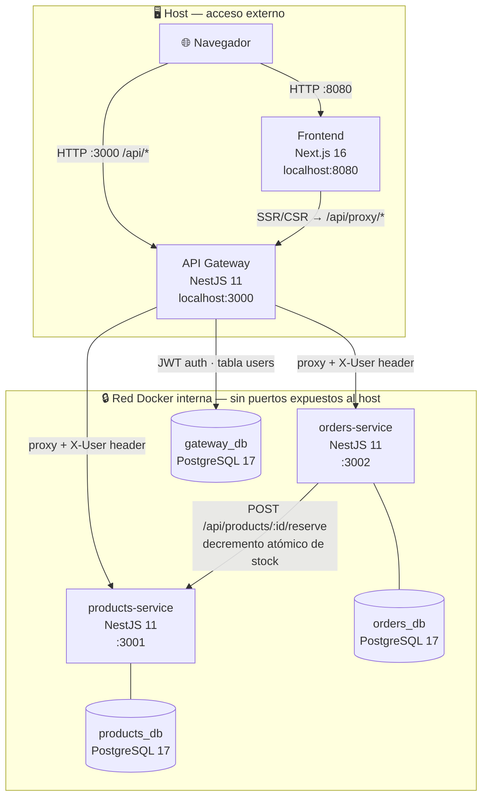
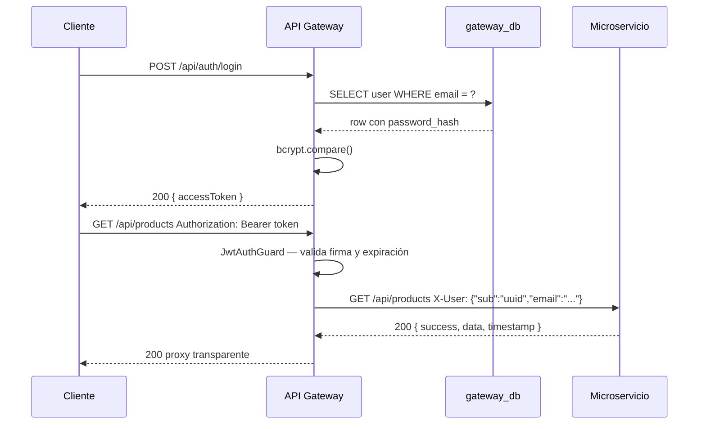
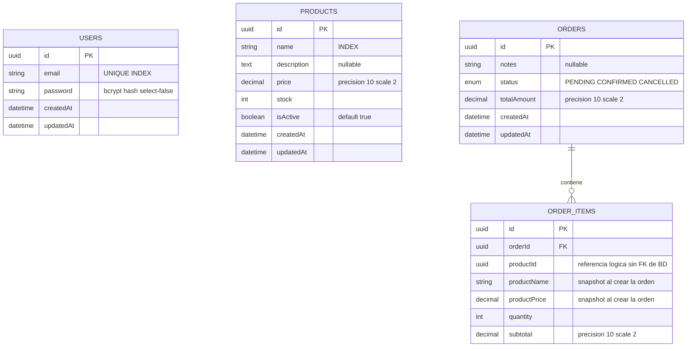

# LinkTic — Plataforma E-commerce con Microservicios

[](https://nodejs.org/)
[](https://nestjs.com/)
[](https://nextjs.org/)
[](https://www.postgresql.org/)
[](https://docs.docker.com/compose/)
[](https://jestjs.io/)

---

## Descripción General

**LinkTic** es una plataforma de comercio electrónico construida como una prueba técnica de nivel producción bajo arquitectura de microservicios. El sistema permite gestionar un catálogo de productos y procesar órdenes de compra desde una interfaz web moderna.

El mono-repositorio contiene cuatro componentes principales:

| Servicio | Tecnología | Puerto host | Descripción |
|---|---|---|---|
| `api-gateway` | NestJS 11 | **3000** | Punto de entrada único. Autenticación JWT centralizada y proxy hacia los servicios internos. |
| `products-service` | NestJS 11 | interno | CRUD del catálogo de productos con soft-delete. |
| `orders-service` | NestJS 11 | interno | Creación y gestión de órdenes con validación de stock. |
| `frontend` | Next.js 16 / React 19 | **8080** | UI de cliente construida con Tailwind CSS 4 y App Router. |

---

## Arquitectura

### Diagrama de Servicios



### Flujo de Autenticación



### Patrones de Comunicación

- **Cliente → Gateway**: HTTP REST con JWT en el header `Authorization: Bearer <token>`.
- **Gateway → Microservicios**: HTTP interno con el header `X-User` que contiene el payload del JWT ya decodificado (`{ sub, email }`). Los microservicios no validan tokens.
- **orders-service → products-service**: HTTP interno con `POST /products/:id/reserve` para decrementar stock de forma **atómica** (un solo `UPDATE WHERE stock >= qty`). Si la transacción de la orden falla después de reservar, se llama `POST /products/:id/release` para devolver el stock. Elimina condiciones de carrera sin locks explícitos.
- **Frontend → Gateway**: En el servidor (SSR) llama directamente a la URL del gateway; en el navegador usa el proxy de Next.js (`/api/proxy/*`) que inyecta el token desde la cookie `httpOnly`.

---

## Modelo de Datos (ERD)



> **Bases de datos independientes:** `gateway_db` aloja `USERS`; `products_db` aloja `PRODUCTS`; `orders_db` aloja `ORDERS` y `ORDER_ITEMS`. No existe FK de base de datos entre `ORDER_ITEMS.productId` y la tabla `PRODUCTS` — la integridad se garantiza en la capa de aplicación al momento de crear la orden.

---

## Requisitos Previos

| Herramienta | Versión mínima | Notas |
|---|---|---|
| Docker | 27.x | [Instalación oficial](https://docs.docker.com/get-docker/) |
| Docker Compose | v2.x (plugin) | Incluido con Docker Desktop 3.6+ |
| Node.js *(opcional)* | 22 LTS | Solo necesario para desarrollo fuera de Docker |
| npm *(opcional)* | 10.x | Incluido con Node.js 22 |

Verificar instalación:

```bash
docker --version          # Docker version 27.x.x
docker compose version    # Docker Compose version v2.x.x
node --version            # v22.x.x  (solo si se desarrolla localmente)
```

---

## Instalación y Configuración

### 1. Clonar el repositorio

```bash
git clone <url-del-repositorio>
cd linktic
```

### 2. Configurar variables de entorno

Copiar los archivos `.env.example` para cada servicio:

```bash
cp api-gateway/.env.example   api-gateway/.env
cp products-service/.env.example  products-service/.env
cp orders-service/.env.example    orders-service/.env
cp frontend/.env.example          frontend/.env.local
```

> Para desarrollo local con Docker Compose los valores por defecto son suficientes. En producción **cambia `JWT_SECRET`** por una cadena aleatoria segura de mínimo 32 caracteres.

### 3. Levantar todos los servicios

```bash
docker compose up --build
```

Docker Compose respeta los `healthcheck` definidos y levanta los servicios en el orden correcto:

```
postgres-products  →  products-service
postgres-orders    →  orders-service
postgres-gateway   →  api-gateway  (espera products + orders healthy)
                   →  frontend
```

El esquema de base de datos se crea automáticamente al arrancar gracias a `synchronize: true` de TypeORM (modo desarrollo).

### 4. URLs de acceso

| Interfaz | URL |
|---|---|
| Frontend (UI) | http://localhost:8080 |
| API REST (gateway) | http://localhost:3000/api |
| Swagger — API Gateway | http://localhost:3000/api/docs |
| Health — API Gateway | http://localhost:3000/api/health |

> `products-service` (`:3001`) y `orders-service` (`:3002`) **no tienen puertos publicados al host**. Son accesibles únicamente dentro de la red Docker interna.

---

## Variables de Entorno

### `api-gateway/.env`

| Variable | Descripción | Valor de ejemplo |
|---|---|---|
| `NODE_ENV` | Entorno de ejecución | `development` |
| `PORT` | Puerto en el que escucha el gateway | `3000` |
| `DB_HOST` | Host de PostgreSQL (`gateway_db`) | `localhost` |
| `DB_PORT` | Puerto de PostgreSQL | `5432` |
| `DB_USER` | Usuario de PostgreSQL | `postgres` |
| `DB_PASS` | Contraseña de PostgreSQL | `postgres` |
| `DB_NAME` | Nombre de la base de datos | `gateway_db` |
| `JWT_SECRET` | Secreto para firmar y verificar tokens JWT | `change-me-in-production` |
| `JWT_EXPIRES_IN` | Tiempo de expiración del token | `24h` |
| `PRODUCTS_SERVICE_URL` | URL interna del products-service | `http://localhost:3001` |
| `ORDERS_SERVICE_URL` | URL interna del orders-service | `http://localhost:3002` |

### `products-service/.env`

| Variable | Descripción | Valor de ejemplo |
|---|---|---|
| `NODE_ENV` | Entorno de ejecución | `development` |
| `PORT` | Puerto en el que escucha el servicio | `3001` |
| `DB_HOST` | Host de PostgreSQL (`products_db`) | `localhost` |
| `DB_PORT` | Puerto de PostgreSQL | `5432` |
| `DB_USER` | Usuario de PostgreSQL | `postgres` |
| `DB_PASS` | Contraseña de PostgreSQL | `postgres` |
| `DB_NAME` | Nombre de la base de datos | `products_db` |

### `orders-service/.env`

| Variable | Descripción | Valor de ejemplo |
|---|---|---|
| `NODE_ENV` | Entorno de ejecución | `development` |
| `PORT` | Puerto en el que escucha el servicio | `3002` |
| `DB_HOST` | Host de PostgreSQL (`orders_db`) | `localhost` |
| `DB_PORT` | Puerto de PostgreSQL | `5432` |
| `DB_USER` | Usuario de PostgreSQL | `postgres` |
| `DB_PASS` | Contraseña de PostgreSQL | `postgres` |
| `DB_NAME` | Nombre de la base de datos | `orders_db` |
| `PRODUCTS_SERVICE_URL` | URL del products-service para validar stock | `http://localhost:3001` |

### `frontend/.env.local`

| Variable | Descripción | Valor de ejemplo |
|---|---|---|
| `NEXT_PUBLIC_API_URL` | URL pública del API Gateway (accesible desde el navegador) | `http://localhost:3000/api` |

---

## Endpoints de la API

Toda la API pública se accede a través del gateway en `http://localhost:3000/api`.

### Formato de respuesta

**Respuesta exitosa** — el payload siempre va dentro de `data`:

```json
{
  "success": true,
  "data": {},
  "timestamp": "2025-01-15T10:30:00.000Z"
}
```

**Respuesta de error**:

```json
{
  "statusCode": 404,
  "timestamp": "2025-01-15T10:30:00.000Z",
  "path": "/api/products/id-inexistente",
  "message": "Product with id \"id-inexistente\" not found"
}
```

---

### 🔓 Autenticación — sin token requerido

#### `POST /api/auth/register`

Registra un nuevo usuario. La contraseña debe tener mínimo 8 caracteres con al menos una mayúscula, una minúscula y un dígito.

```bash
curl -s -X POST http://localhost:3000/api/auth/register \
  -H "Content-Type: application/json" \
  -d '{"email": "dev@linktic.com", "password": "Secret123"}'
```

Respuesta `201 Created`:

```json
{
  "id": "a1b2c3d4-e5f6-7890-abcd-ef1234567890",
  "email": "dev@linktic.com"
}
```

| Campo | Tipo | Requerido | Restricciones |
|---|---|---|---|
| `email` | `string` | ✅ | formato email válido |
| `password` | `string` | ✅ | 8–64 chars · mayúscula + minúscula + dígito |

Errores: `400` validación · `409` email ya registrado.

---

#### `POST /api/auth/login`

Autentica un usuario y devuelve un JWT Bearer.

```bash
curl -s -X POST http://localhost:3000/api/auth/login \
  -H "Content-Type: application/json" \
  -d '{"email": "dev@linktic.com", "password": "Secret123"}'
```

Respuesta `200 OK`:

```json
{
  "accessToken": "eyJhbGciOiJIUzI1NiIsInR5cCI6IkpXVCJ9.eyJzdWIiOiJhMWIyYzNkNCIsImVtYWlsIjoiZGV2QGxpbmt0aWMuY29tIn0.signature"
}
```

Errores: `400` validación · `401` credenciales inválidas.

---

### 🔐 Productos — requiere `Authorization: Bearer <token>`

```bash
# Exportar el token para reutilizarlo en los siguientes ejemplos
TOKEN="eyJhbGciOiJIUzI1NiIsInR5cCI6IkpXVCJ9..."
```

#### `GET /api/products`

Lista los productos activos. Soporta filtros opcionales por query string.

| Parámetro | Tipo | Descripción |
|---|---|---|
| `search` | `string` | Filtra por nombre (LIKE `%valor%`) |
| `isActive` | `boolean` | Filtrar por estado (por defecto `true`) |

```bash
curl -s "http://localhost:3000/api/products?search=laptop" \
  -H "Authorization: Bearer $TOKEN"
```

Respuesta `200 OK`:

```json
{
  "success": true,
  "data": [
    {
      "id": "550e8400-e29b-41d4-a716-446655440001",
      "name": "Laptop Pro 15",
      "description": "High performance laptop",
      "price": "1299.99",
      "stock": 50,
      "isActive": true,
      "createdAt": "2025-01-10T08:00:00.000Z",
      "updatedAt": "2025-01-10T08:00:00.000Z"
    }
  ],
  "timestamp": "2025-01-15T10:30:00.000Z"
}
```

---

#### `POST /api/products`

Crea un nuevo producto en el catálogo.

```bash
curl -s -X POST http://localhost:3000/api/products \
  -H "Authorization: Bearer $TOKEN" \
  -H "Content-Type: application/json" \
  -d '{
    "name": "Laptop Pro 15",
    "description": "High performance laptop",
    "price": 1299.99,
    "stock": 50
  }'
```

Respuesta `201 Created` — mismo esquema que el objeto de producto mostrado arriba.

| Campo | Tipo | Requerido | Restricciones |
|---|---|---|---|
| `name` | `string` | ✅ | 2–255 caracteres |
| `description` | `string` | ❌ | texto libre |
| `price` | `number` | ✅ | positivo, máx. 2 decimales |
| `stock` | `integer` | ✅ | ≥ 0 |

---

#### `GET /api/products/:id`

Obtiene un único producto por su UUID.

```bash
curl -s http://localhost:3000/api/products/550e8400-e29b-41d4-a716-446655440001 \
  -H "Authorization: Bearer $TOKEN"
```

Errores: `404` producto no encontrado o inactivo.

---

#### `PATCH /api/products/:id`

Actualización parcial. Todos los campos son opcionales.

```bash
curl -s -X PATCH \
  http://localhost:3000/api/products/550e8400-e29b-41d4-a716-446655440001 \
  -H "Authorization: Bearer $TOKEN" \
  -H "Content-Type: application/json" \
  -d '{"stock": 45, "price": 1249.99}'
```

Respuesta `200 OK` con el producto actualizado.

---

#### `DELETE /api/products/:id`

Soft-delete: establece `isActive: false`. El producto deja de aparecer en los listados pero sus datos se preservan para el historial de órdenes.

```bash
curl -s -X DELETE \
  http://localhost:3000/api/products/550e8400-e29b-41d4-a716-446655440001 \
  -H "Authorization: Bearer $TOKEN"
```

Respuesta `204 No Content`.

---

### ⚙️ Stock — endpoints internos (usados por orders-service)

> Estos endpoints **no pasan por el API Gateway** — son llamadas internas entre contenedores Docker. No requieren JWT.

#### `POST /api/products/:id/reserve`

Decrementa el stock de forma **atómica** mediante un `UPDATE … WHERE stock >= quantity`. Si dos peticiones concurrentes piden el último stock disponible, solo una gana — la otra recibe `409 Conflict`. Elimina la condición de carrera sin locks explícitos.

```bash
curl -s -X POST \
  http://localhost:3001/api/products/550e8400-e29b-41d4-a716-446655440001/reserve \
  -H "Content-Type: application/json" \
  -d '{"quantity": 2}'
```

| Código | Descripción |
|--------|-------------|
| `200` | Stock reservado, retorna el producto actualizado |
| `404` | Producto no encontrado |
| `400` | Producto inactivo |
| `409` | Stock insuficiente |

#### `POST /api/products/:id/release`

Incrementa el stock de vuelta (camino de rollback). Se invoca desde `orders-service` si la transacción de BD falla después de haber reservado stock.

```bash
curl -s -X POST \
  http://localhost:3001/api/products/550e8400-e29b-41d4-a716-446655440001/release \
  -H "Content-Type: application/json" \
  -d '{"quantity": 2}'
```

Respuesta `200 OK`.

---

### 🔐 Órdenes — requiere `Authorization: Bearer <token>`

#### `GET /api/orders`

Lista todas las órdenes con sus ítems. Soporta filtro por estado.

| Parámetro | Tipo | Valores |
|---|---|---|
| `status` | `string` | `PENDING` · `CONFIRMED` · `CANCELLED` |

```bash
curl -s "http://localhost:3000/api/orders?status=PENDING" \
  -H "Authorization: Bearer $TOKEN"
```

Respuesta `200 OK`:

```json
{
  "success": true,
  "data": [
    {
      "id": "7c9e6679-7425-40de-944b-e07fc1f90ae7",
      "notes": "Entregar antes del mediodía",
      "status": "PENDING",
      "totalAmount": "2599.98",
      "items": [
        {
          "id": "a0eebc99-9c0b-4ef8-bb6d-6bb9bd380a11",
          "orderId": "7c9e6679-7425-40de-944b-e07fc1f90ae7",
          "productId": "550e8400-e29b-41d4-a716-446655440001",
          "productName": "Laptop Pro 15",
          "productPrice": "1299.99",
          "quantity": 2,
          "subtotal": "2599.98"
        }
      ],
      "createdAt": "2025-01-15T09:00:00.000Z",
      "updatedAt": "2025-01-15T09:00:00.000Z"
    }
  ],
  "timestamp": "2025-01-15T10:30:00.000Z"
}
```

---

#### `POST /api/orders`

Crea una nueva orden. Valida existencia del producto, estado activo y stock disponible dentro de una única transacción de base de datos. Los precios y nombres se capturan como snapshot inmutable.

```bash
curl -s -X POST http://localhost:3000/api/orders \
  -H "Authorization: Bearer $TOKEN" \
  -H "Content-Type: application/json" \
  -d '{
    "notes": "Entregar antes del mediodía",
    "items": [
      { "productId": "550e8400-e29b-41d4-a716-446655440001", "quantity": 2 }
    ]
  }'
```

| Campo | Tipo | Requerido | Restricciones |
|---|---|---|---|
| `notes` | `string` | ❌ | texto libre |
| `items` | `array` | ✅ | mínimo 1 ítem |
| `items[].productId` | `uuid` | ✅ | debe existir y estar activo |
| `items[].quantity` | `integer` | ✅ | ≥ 1 y ≤ stock disponible |

Errores: `400` producto inactivo o stock insuficiente · `404` producto no encontrado · `503` products-service no disponible.

---

#### `GET /api/orders/:id`

Obtiene una orden por UUID incluyendo todos sus ítems.

```bash
curl -s http://localhost:3000/api/orders/7c9e6679-7425-40de-944b-e07fc1f90ae7 \
  -H "Authorization: Bearer $TOKEN"
```

Errores: `404` orden no encontrada.

---

#### `PATCH /api/orders/:id`

Actualiza el estado de una orden.

```bash
curl -s -X PATCH \
  http://localhost:3000/api/orders/7c9e6679-7425-40de-944b-e07fc1f90ae7 \
  -H "Authorization: Bearer $TOKEN" \
  -H "Content-Type: application/json" \
  -d '{"status": "CONFIRMED"}'
```

| Campo | Tipo | Valores aceptados |
|---|---|---|
| `status` | `string` | `PENDING` · `CONFIRMED` · `CANCELLED` |

---

### 🩺 Health Checks — sin token requerido

```bash
# API Gateway (accesible desde el host)
curl -s http://localhost:3000/api/health
```

Respuesta `200 OK`:

```json
{ "status": "ok", "service": "api-gateway", "timestamp": "2025-01-15T10:30:00.000Z" }
```

> Los health checks de `products-service` (`:3001`) y `orders-service` (`:3002`) son utilizados internamente por Docker Compose para las dependencias de arranque. No están expuestos al host.

---

## Estructura del Proyecto

```
linktic/
├── docker-compose.yml                    # Orquestación de todos los servicios
├── .env.example                          # Variables compartidas de desarrollo
│
├── api-gateway/                          # Punto de entrada único — puerto 3000
│   ├── src/
│   │   ├── app.module.ts
│   │   ├── main.ts                       # Bootstrap, Swagger, ValidationPipe
│   │   ├── auth/                         # Autenticación JWT centralizada
│   │   │   ├── auth.controller.ts        # POST /auth/register  /auth/login
│   │   │   ├── auth.service.ts           # bcrypt + JwtService
│   │   │   ├── auth.service.spec.ts      # 9 tests unitarios
│   │   │   ├── user.entity.ts            # Tabla users en gateway_db
│   │   │   ├── dto/                      # RegisterDto, LoginDto
│   │   │   ├── guards/                   # JwtAuthGuard
│   │   │   └── strategies/              # JwtStrategy (passport-jwt)
│   │   ├── proxy/
│   │   │   ├── products.proxy.controller.ts   # Proxy → products-service
│   │   │   └── orders.proxy.controller.ts     # Proxy → orders-service
│   │   ├── health/
│   │   ├── config/
│   │   └── common/filters/
│   ├── test/
│   ├── Dockerfile                        # Multi-etapa: deps → build → production
│   └── package.json
│
├── products-service/                     # Catálogo de productos — interno :3001
│   ├── src/
│   │   ├── products/
│   │   │   ├── product.entity.ts         # Tabla products en products_db
│   │   │   ├── products.controller.ts    # CRUD REST
│   │   │   ├── products.service.ts       # Lógica de negocio + soft-delete
│   │   │   ├── products.service.spec.ts  # 19 tests unitarios
│   │   │   └── dto/                      # CreateProductDto, UpdateProductDto, QueryProductDto
│   │   ├── health/
│   │   ├── config/
│   │   ├── common/                       # TransformInterceptor, AllExceptionsFilter
│   │   └── data-source.ts                # TypeORM DataSource para CLI de migraciones
│   ├── test/
│   ├── .versionrc.json                   # tagPrefix: "products-service-v"
│   ├── Dockerfile
│   └── package.json
│
├── orders-service/                       # Gestión de órdenes — interno :3002
│   ├── src/
│   │   ├── orders/
│   │   │   ├── order.entity.ts           # Tabla orders en orders_db
│   │   │   ├── order-item.entity.ts      # Tabla order_items
│   │   │   ├── orders.controller.ts
│   │   │   ├── orders.service.ts         # Lógica con QueryRunner + transacción
│   │   │   ├── orders.service.spec.ts    # 17 tests unitarios
│   │   │   ├── products-client.service.ts # HTTP client → products-service
│   │   │   ├── dto/
│   │   │   └── enums/order-status.enum.ts
│   │   ├── health/
│   │   ├── config/
│   │   ├── common/
│   │   └── data-source.ts
│   ├── test/
│   ├── .versionrc.json                   # tagPrefix: "orders-service-v"
│   ├── Dockerfile
│   └── package.json
│
├── frontend/                             # Next.js 16 App Router — puerto 8080
│   ├── src/
│   │   ├── app/
│   │   │   ├── (auth)/                   # Login y registro (layout público)
│   │   │   │   ├── login/
│   │   │   │   └── register/
│   │   │   ├── products/                 # Listado y gestión de productos
│   │   │   ├── orders/                   # Listado y creación de órdenes
│   │   │   └── api/
│   │   │       ├── auth/logout/          # Route handler para cerrar sesión
│   │   │       └── proxy/               # Proxy SSR que inyecta Bearer token
│   │   │           ├── products/[[...slug]]/
│   │   │           └── orders/[[...slug]]/
│   │   ├── components/
│   │   │   ├── nav/Navbar.tsx
│   │   │   ├── products/                 # ProductCard, ProductsGrid, CreateProductModal
│   │   │   ├── orders/                   # OrderCard, OrderDetail, OrdersList
│   │   │   └── ui/                       # Badge, LoadingSpinner, Modal, Toast
│   │   └── lib/
│   │       ├── api/                      # auth.ts, products.ts, orders.ts
│   │       ├── auth/                     # session.ts, actions.ts (Server Actions)
│   │       └── types.ts                  # Tipos TypeScript compartidos
│   └── package.json
│
└── .github/
    └── workflows/
        ├── products-service.yml           # Pipeline CI/CD del products-service
        └── orders-service.yml             # Pipeline CI/CD del orders-service
```

---

## Ejecución de Tests

Los tests unitarios usan **Jest 30** con `ts-jest`. No requieren base de datos activa — todas las dependencias externas son mockeadas mediante el módulo de testing de NestJS.

### Ejecutar tests por servicio

```bash
# products-service — 19 tests
cd products-service && npm test

# orders-service — 17 tests
cd orders-service && npm test

# api-gateway — 9 tests
cd api-gateway && npm test
```

### Con reporte de cobertura

```bash
npm run test:cov
# Genera informe en ./coverage/lcov-report/index.html
```

### En modo watch (desarrollo activo)

```bash
npm run test:watch
```

### Resumen de suites de test

| Servicio | Archivo | Tests | Cobertura |
|---|---|---|---|
| `products-service` | `products.service.spec.ts` | 19 | `findAll` (con/sin search), `findOne` (NotFoundException), `create`, `update`, `remove` (soft-delete) |
| `orders-service` | `orders.service.spec.ts` | 17 | `findAll`, `findOne`, `create` con transacción y rollback, `update`, validación de stock insuficiente y producto inactivo |
| `api-gateway` | `auth.service.spec.ts` | 9 | `register` (éxito, email duplicado, hash bcrypt), `login` (éxito, usuario inexistente, contraseña incorrecta, generación de token) |
| **Total** | | **45** | |

### Tests end-to-end

Cada servicio incluye `test/app.e2e-spec.ts` con pruebas de integración sobre el servidor NestJS completo:

```bash
npm run test:e2e
```

---

## Migraciones de Base de Datos

En desarrollo TypeORM usa `synchronize: true`, que aplica el esquema automáticamente al arrancar. Para entornos de producción se deben usar migraciones explícitas:

```bash
cd products-service   # o  cd orders-service

# Generar una migración a partir de los cambios en las entidades
npm run migration:generate -- src/migrations/AddProductDiscountField

# Aplicar todas las migraciones pendientes
npm run migration:run

# Revertir la última migración aplicada
npm run migration:revert
```

> El archivo `src/data-source.ts` de cada servicio configura la conexión TypeORM de forma independiente para el uso de la CLI, sin depender del módulo NestJS.

---

## CI/CD — GitHub Actions

Cada microservicio tiene su propio workflow en `.github/workflows/` activado únicamente cuando hay cambios en su directorio (`paths:` filter). Esto evita ejecuciones innecesarias en el mono-repositorio.

### Flujo del pipeline

```mermaid
flowchart LR
    A["Push o PR\na main / develop"] --> B

    subgraph CI ["Job: ci — todos los eventos"]
        B["Checkout\nfetch-depth 0"] --> C["Node.js 22\ncache npm"]
        C --> D["npm ci"]
        D --> E["ESLint"]
        E --> F["npm audit\n--audit-level=high"]
        F --> G["nest build\nTypeScript"]
        G --> H["Jest --coverage\n--forceExit"]
        H --> I["Upload coverage\nartifact 14 días"]
    end

    I --> DEC{{"Push a main?"}}

    subgraph RELEASE ["Job: release — solo push a main"]
        DEC -->|Sí| J["git config\nbot identity"]
        J --> K["npm ci + build"]
        K --> L["standard-version\nbump + CHANGELOG"]
        L --> M["git push\n--follow-tags"]
        M --> N["Docker Buildx\nmulti-stage"]
        N --> O["Smoke test\nnode -e OK"]
    end

    DEC -->|No| Z["✅ Solo CI"]
```



### Detalles del pipeline

| Aspecto | Detalle |
|---|---|
| **Aislamiento por servicio** | `paths: ['products-service/**']` y `paths: ['orders-service/**']` — cada workflow se activa solo ante cambios en su directorio |
| **Concurrencia** | `cancel-in-progress: true` cancela runs obsoletos para la misma rama o PR |
| **Versionado semántico** | `standard-version` analiza commits con formato Conventional Commits y aplica bump automático (`feat` → minor, `fix` → patch) |
| **Tag prefix en mono-repo** | `products-service-v1.2.3` y `orders-service-v1.2.3` — sin colisiones de tags en el mismo repositorio |
| **Imagen Docker** | Build multi-etapa con `target: production`; `push: false` (verificación local, sin credenciales de registry) |
| **Cache Docker** | Layer cache respaldada por GitHub Actions cache (`type=gha, mode=max`) |
| **Prevención de bucles** | El commit de release incluye `[skip ci]` para no re-disparar el workflow |
| **Artifacts** | Reporte de cobertura subido como artifact con retención de 14 días |

---

## Decisiones Técnicas

| # | Decisión | Justificación |
|---|---|---|
| **1** | **Autenticación centralizada en el API Gateway** | Los microservicios no tienen código de auth. Un único punto de validación de tokens reduce la superficie de error y permite escalar los servicios de dominio de forma independiente. |
| **2** | **Header `X-User` para contexto downstream** | El gateway decodifica el JWT y reenvía `{ sub, email }` como header JSON. Los servicios internos acceden al caller sin revalidar el token, manteniendo separación de responsabilidades y evitando dependencia del secreto JWT en cada servicio. |
| **3** | **Tres instancias PostgreSQL independientes** | `gateway_db`, `products_db` y `orders_db` garantizan aislamiento total de esquema. Ningún servicio puede acceder a los datos de otro a nivel de base de datos, respetando el principio de propiedad de datos en microservicios. |
| **4** | **Solo el API Gateway expuesto al host (puerto 3000)** | `products-service` y `orders-service` no tienen `ports:` en `docker-compose.yml`. Reducción de superficie de ataque y topología de red más limpia. |
| **5** | **Una sola variable de entorno en el frontend** (`NEXT_PUBLIC_API_URL`) | Todo el enrutamiento lo gestiona el gateway internamente. El frontend no necesita conocer las URLs de los microservicios, simplificando la configuración de despliegue. |
| **6** | **Snapshots desnormalizados en `order_items`** | `productName` y `productPrice` se copian al momento de crear la orden. Los cambios futuros en el catálogo (precio, nombre, soft-delete) no afectan el historial de órdenes. |
| **7** | **Referencia lógica cross-service en `order_items.productId`** | UUID sin FK de base de datos. La integridad se valida en la capa de aplicación al crear la orden mediante una llamada HTTP a `products-service`. Evita acoplamiento a nivel de BD entre bases de datos independientes. |
| **8** | **Soft-delete para productos (`isActive: false`)** | El producto desaparece del catálogo activo pero sus datos persisten, preservando la coherencia de las órdenes históricas que lo referencian. |
| **9** | **Decremento atómico de stock con `UPDATE … WHERE stock >= qty`** | En lugar de leer el stock y luego actualizar (TOCTOU), `products-service` ejecuta un solo `UPDATE products SET stock = stock - qty WHERE id = :id AND stock >= qty`. Si `affected = 0`, el stock era insuficiente. Dos peticiones concurrentes por el último stock solo pueden ganar una — PostgreSQL serializa la escritura sin locks explícitos. El `orders-service` llama a `POST /products/:id/release` como rollback si la transacción de la orden falla después de reservar. |
| **10** | **Transacciones con `QueryRunner` en creación de órdenes** | La reserva de stock y la inserción de todos los `order_items` se ejecutan coordinadas. Si la BD de órdenes falla después de reservar stock, el `catch` llama `releaseStock` para devolver las unidades. |
| **11** | **Dockerfiles multi-etapa (`deps → build → production`)** | La imagen final contiene solo el JS compilado + `node_modules` de producción (~120 MB). El compilador TypeScript no está presente en producción. Se crea un usuario sin privilegios (`appuser`) para el proceso. |
| **12** | **CI/CD con tags prefijados por servicio** | `products-service-v*` y `orders-service-v*` evitan colisiones de tags semver en el mono-repositorio. `standard-version` lee `.versionrc.json` en cada servicio para aplicar el prefijo correcto y genera un `CHANGELOG.md` por servicio. |

---

## Swagger / OpenAPI

Cada servicio NestJS expone documentación interactiva en la ruta `/api/docs`:

| Servicio | URL |
|---|---|
| API Gateway | http://localhost:3000/api/docs |
| products-service | `http://products-service:3001/api/docs` *(solo dentro de la red Docker)* |
| orders-service | `http://orders-service:3002/api/docs` *(solo dentro de la red Docker)* |

En el Swagger del gateway, usar el botón **Authorize** con el token obtenido del endpoint `POST /api/auth/login` para probar los endpoints protegidos directamente desde el navegador.
